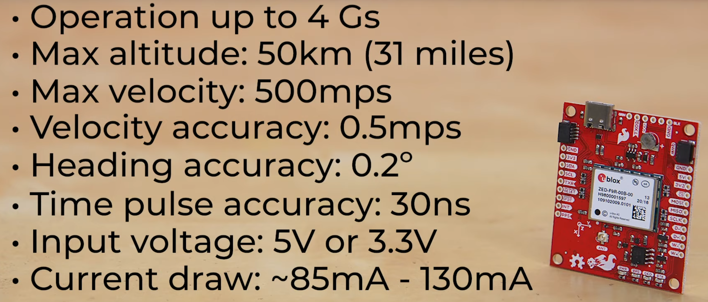

 

# Materials comparison

## GNSS/GPS HAT

| Link                                                         | Description                                                  | Pros                                                         | Cons                                                         | Price      |
| ------------------------------------------------------------ | ------------------------------------------------------------ | ------------------------------------------------------------ | ------------------------------------------------------------ | ---------- |
| https://www.pi-shop.ch/sparkfun-gps-rtk-dead-reckoning-phat-for-raspberry-pi |  RPI GNSS/RTK Hat | - Available in CH - < 0.2m/20cm accuracy - Good doc | - Pricey -Max altitude : 50km - Might need Antenna | 325.90 CHF |
| https://www.bastelgarage.ch/gps-l76x-multi-gnss-hat-fur-raspberry-pi | https://www.waveshare.com/w/upload/c/c2/L76X_GPS_HAT_user_manual_en.pdf | - Available in CH - Cheap  - Good doc              | - 2.5m accuracy -Only horinzontal accuracy (need accelerometer) | 34.90 CHF  |
| https://www.pi-shop.ch/zed-f9p-gps-rtk-hat-for-raspberry-pi  | https://www.waveshare.com/zed-f9p-gps-rtk-hat.htm            | - Better than M8P - < 1cm accuracy - Good doc      | - Pricey - Unavailable in CH                            | 389.00 CHF |

## Drones with GNSS/GPS

| Link                                 | Description                  | Pros | Cons | Price                                       |
| ------------------------------------ | ---------------------------- | ---- | ---- | ------------------------------------------- |
| https://www.dji.com/ch/phantom-4-rtk | Drone with GNSS/RTK embedded |      |      | 6200$ (found on swiss market at 5300.- chf) |
|                                      |                              |      |      |                                             |
|                                      |                              |      |      |                                             |
|                                      |                              |      |      |                                             |

## barometric sensors: 

| Link                                                         | Description                         | Pros                             | Cons                                                         | Price |
| ------------------------------------------------------------ | ----------------------------------- | -------------------------------- | ------------------------------------------------------------ | ----- |
| https://raspberrypi-tutorials.fr/raspberry-pi-et-i2c-capteur-de-pression-dair-bmp180/ | BMP180 simple pressure sensor       | - cheap - easy to implement | can't measure humidity                                       |       |
| https://www.pi-shop.ch/grove-temp-humi-barometer-sensor-bme280 | BME280 pressure and humidity sensor |                                  | - low documentation - need for shield  - 1Hz ? - |       |
| https://www.amazon.fr/NEYOANN-modules-capteur-temp%C3%A9rature-dhumidit%C3%A9/dp/B09FPWK2GS/ref=sr_1_2?keywords=dht22&qid=1648795456&sr=8-2 | DHT22 pressuran and humidity sensor | git                              |                                                              |       |
|                                                              |                                     |                                  |                                                              |       |

https://wonderfulengineering.com/10-best-barometer-raspberry-pi/

